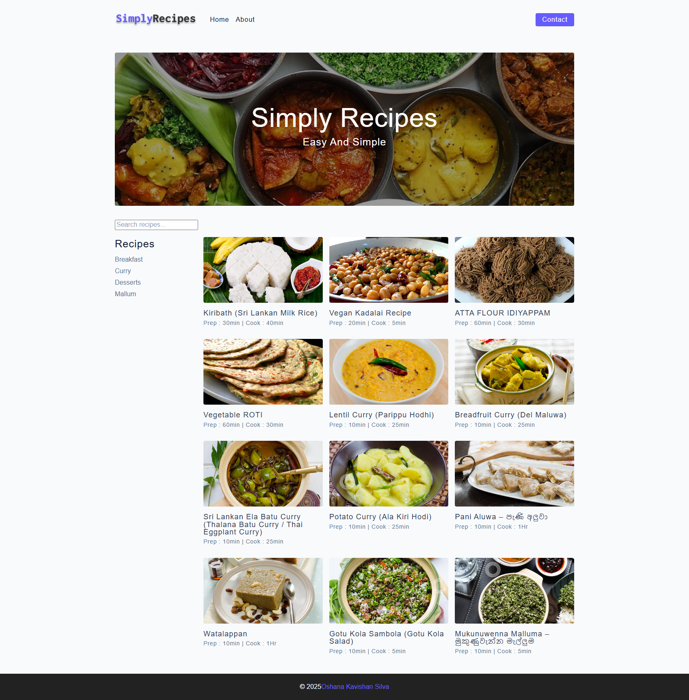

# 🍽️ Simply Recipes

Welcome to **Simply Recipes**, a clean and simple React + Vite web app featuring delicious Sri Lankan recipes that are easy to make and perfect for everyday cooking! 🇱🇰✨

---

## 📝 About

Simply Recipes is a React-based recipe website created with Vite and JavaScript. It showcases a collection of authentic Sri Lankan dishes that are simple to prepare, with a clean and user-friendly interface.

---

## 🌟 Features

- 🔎 **Search Recipes:** Easily find recipes by name using the search bar.  
- 🏷️ **Recipe Tags:** Browse recipes by categories like Breakfast, Curry, Desserts, and more.  
- 📱 **Responsive Design:** Works beautifully on mobile, tablet, and desktop screens.  
- ⚡ **Fast & Lightweight:** Built with React and Vite for quick loading times.  
- ❌ **No Backend Yet:** Currently static, no backend or database — all data is stored locally in JSON format.  
- 📸 **Recipe Details:** Click on any recipe to see prep time, cook time, description, and images.  

---

## 📸 Screenshots

  
_Home page with recipe search and tags_

---

## 🛠️ Tech Stack

- React  
- Vite  
- JavaScript (ES6+)  
- React Router DOM  
- CSS (your styling method)  

---
## 💡 How to Run Locally

1. Clone the repo:  
```bash
git clone https://github.com/OshanaKavishan/Simple-Recipe-Website.git
cd simply-recipes
```
2. Install dependencies:
```bash
npm install
```
3. Start the development server:
```bash
npm run dev
```
4. Open your browser at http://localhost:5173

## 🤝 Contributing

Contributions are welcome!  
Feel free to open issues or submit pull requests to:

- ✨ Improve features
- 🐞 Fix bugs
- 🧑‍🍳 Add more delicious Sri Lankan recipes

---

## 🙏 Thanks for Visiting Simply Recipes!

Happy cooking and keep exploring tasty dishes! 🍛🔥  
Built with ❤️ using **React + Vite**

---

## 🤝 Let's Work Together

I'm Oshana Kavishan — passionate about building modern web and mobile applications.  
If you're interested in working together or just want to connect, feel free to reach out!

- 📧 Email: kavishansilva@gmail.com  
- 🔗 LinkedIn: [linkedin.com/in/oshana-kavishan-9ab10b23b](https://www.linkedin.com/in/oshana-kavishan-9ab10b23b)  
- 💻 GitHub: [github.com/OshanaKavishan](https://github.com/OshanaKavishan)

